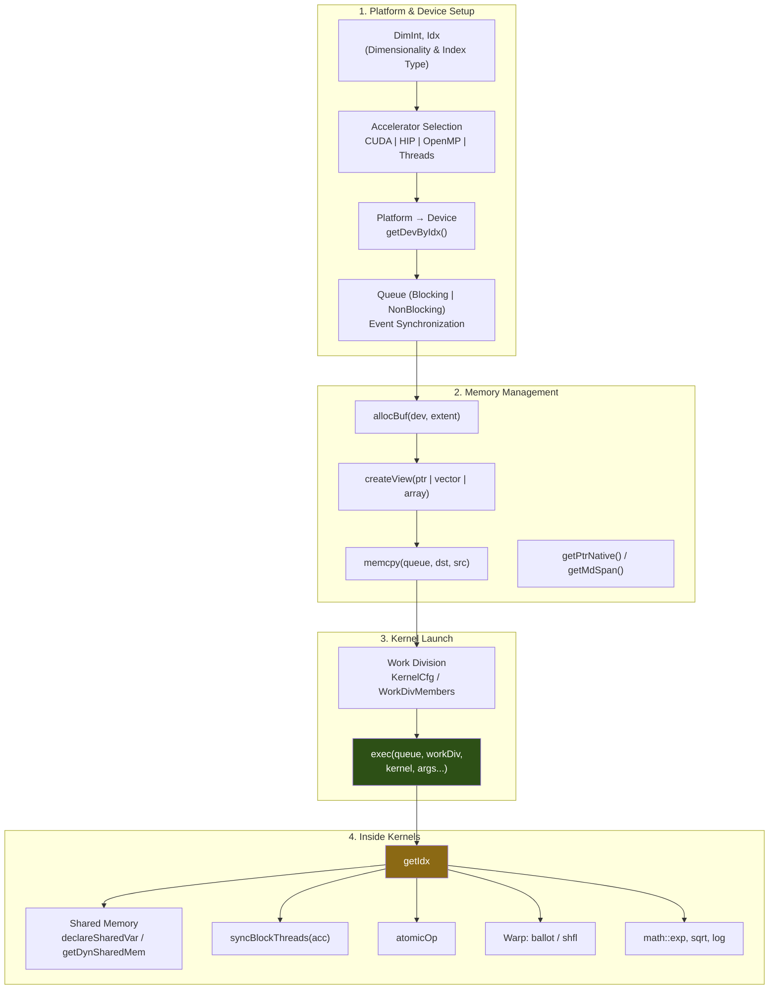

# ALPAKA Guide

A comprehensive API reference for the [Alpaka](https://github.com/alpaka-group/alpaka) (Abstraction Library for Parallel Kernel Acceleration) framework. Covers the full API surface from device setup through kernel execution, memory management, synchronization, and warp intrinsics.



## API Categories

### Platform & Device
| API | Purpose |
|---|---|
| `DimInt<N>`, `Idx` | Define kernel dimensionality and index type |
| `AccGpuCudaRt`, `AccGpuHipRt`, `AccCpuOmp2Blocks` | Backend accelerator selection |
| `Platform<Acc>`, `getDevByIdx(platform, i)` | Device enumeration |
| `Queue<Acc, Blocking \| NonBlocking>` | Work submission and sync |
| `Event<Queue>` | Fine-grained synchronization |

### Memory Management
| API | Purpose |
|---|---|
| `allocBuf<T, Idx>(dev, extent)` | Allocate typed buffer on device |
| `createView(host, ptr, extent)` | Wrap existing host memory |
| `memcpy(queue, dst, src, extent)` | Host-device transfers |
| `view::getPtrNative(buf)` | Extract raw pointer |
| `experimental::getMdSpan(buf)` | Multi-dimensional indexing |

### Kernel Execution
| API | Purpose |
|---|---|
| `KernelCfg<Acc>` + `getValidWorkDiv(...)` | Automatic work division |
| `WorkDivMembers<Dim, Idx>(blocks, threads, elems)` | Manual work division |
| `exec<Acc>(queue, workDiv, kernel, args...)` | Async kernel launch |
| `ALPAKA_FN_ACC` | Device code annotation |

### In-Kernel Primitives
| API | Purpose |
|---|---|
| `getIdx<Origin, Unit>(acc)` | Thread/block/grid indices |
| `uniformElements(acc, extent)` | Balanced 1D iteration |
| `uniformElementsAlongX/Y/Z(acc, extent)` | ND iteration helpers |
| `declareSharedVar<T, ID>(acc)` | Static shared memory |
| `getDynSharedMem<T>(acc)` | Dynamic shared memory |
| `syncBlockThreads(acc)` | Block-level barrier |
| `atomicOp<Op>(acc, ptr, val)` | Atomic operations |
| `warp::ballot / shfl` | Warp-level intrinsics |
| `math::sqrt, exp, log, tanh` | Device math functions |

## Quick Start

```cpp
#include <alpaka/alpaka.hpp>

using Dim = alpaka::DimInt<1>;
using Idx = std::size_t;
using Acc = alpaka::AccGpuCudaRt<Dim, Idx>;

auto platform = alpaka::Platform<Acc>{};
auto dev = alpaka::getDevByIdx(platform, 0);
auto queue = alpaka::Queue<Acc, alpaka::Blocking>{dev};

// Allocate and transfer
auto buf = alpaka::allocBuf<float, Idx>(dev, 1024);

// Launch kernel
auto workDiv = alpaka::getValidWorkDiv<Acc>(dev, 1024, 1);
alpaka::exec<Acc>(queue, workDiv, MyKernel{}, alpaka::getPtrNative(buf), 1024);
```

## Tech Stack

- **C++17**
- **Alpaka** >= 1.0
- Backends: **CUDA**, **HIP**, **OpenMP**, **std::thread**, **TBB**

## Contributing

1. Fork the repository
2. Improve or extend the API reference
3. Submit a pull request

## License

This project is available under the MIT License.
